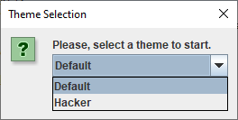
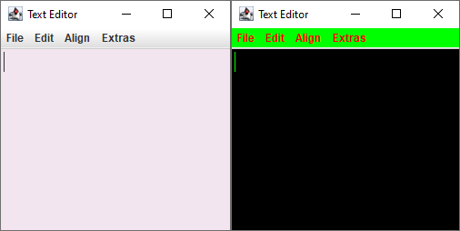
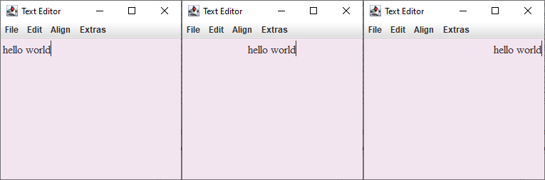
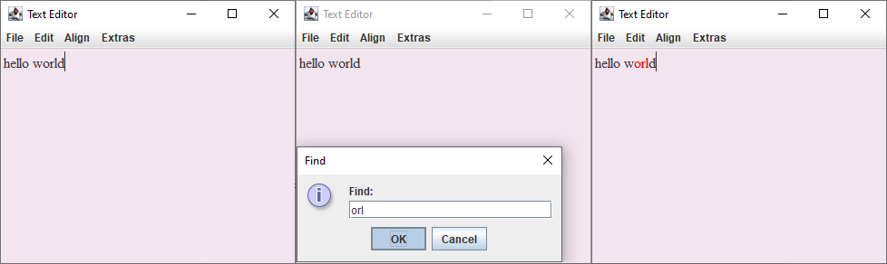
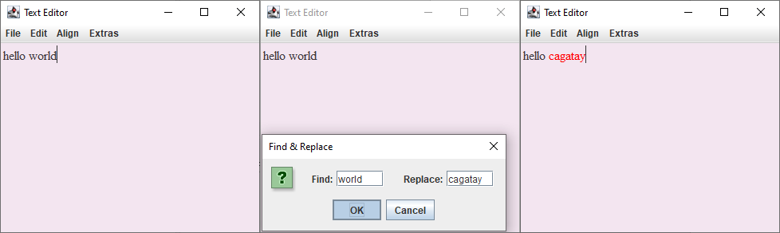
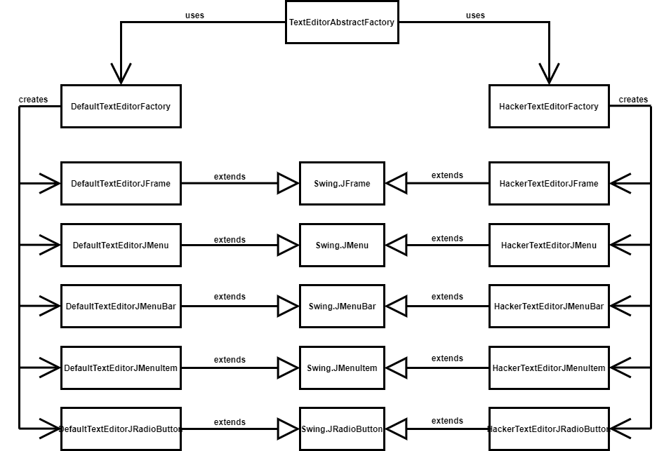
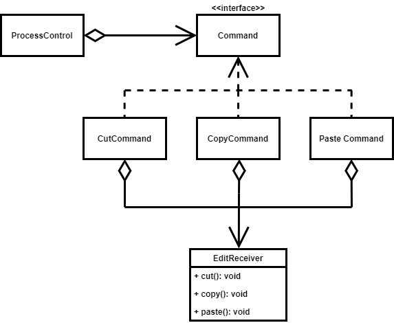
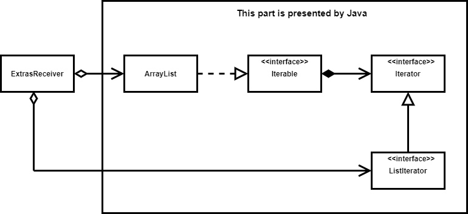
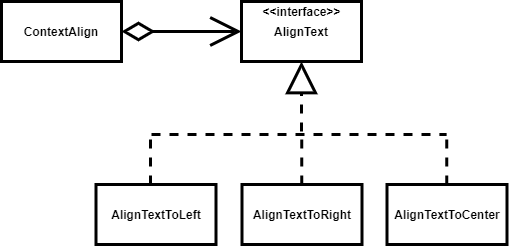
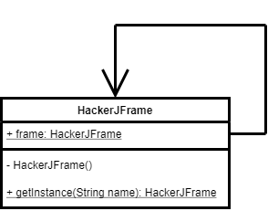

# Inspiration
This is a text editor application which is developed in Java and it has the functionality of 
* opening a new file, 
* saving the current file,
* aligning the text, 
* finding the specific string in the text,
* replacing the specific string with another one

## Main Idea
This application aims to improve knowledge about test driven development, object oriented development and development using design patterns. It includes the design patterns are given below.
* Abstract Factory Design Pattern
* Command Design Pattern
* Iterator Pattern
* Strategy Design Pattern
* Singleton Design Pattern

## Some screenshots from the application:
* Theme Selection:
 

* Default and Hacker Theme:

 
* Aligning Text:

 
* Finding the Specific String in the Text:

 
* Replacing the Specific String with the Another One:

 
## Behind the Scene

### Theme Selection (Factory Pattern)
When the user selected a theme, the application creates a new instance of Default or Hacker factory according to the users selection. Then, each factory creates their appropriate components which are extended and customized from Swing library. The block schema of this implementation is given below.

 
### Menubar Processes (Command Pattern)
The Command Design Pattern has been applied for the processes under the same topic. For example,
* New, Open, Save functionalities which are under the File menu
* Cut, Copy, Paste functionalities which are under the Edit menu
* Right, Left, Center alignments which are under the Align menu
* Undo, Find, Find&Replace functionalities which are under the Extras menu
The block schema of this implementation is given below.
 

User interacts with the ProcessControl, which is the Invoker in terminology, then the Invoker executes the command associated with itself. When the Command got executed, it calls its own method inside the Receiver. This implementation also applied to File, Align and Extras menus.

### Finding the String in the Text (Iterator Pattern)
For finding the specific string in the text, simple naive algorithm was used. To implement this algorithm, we need to slide the string on all over the text. In Java, there is an interface to make it possible which is called ListIterator. It allows programmers to traverse the list in forward and backward direction. The black schema of this situation is given below.

 
### Aligning the Text (Strategy Pattern)
Generally, Strategy Design Pattern is used to make a process in different ways. For example aligning the text. Text can be aligned in different ways such as left, right and middle. The schema of this implementation is given below.

 
This implementation also applied to opening a new file processes which are under the File menus.
### Only One Frame and One Text Area Can Be Exists (Singleton Pattern)
The Singleton Pattern is used to make a process to have exactly and only one. For example the applications frame and the text area. The implementation is given below.

 
This implementation also applied to implementation of DefaultJFrame, DefaultJTextPane, HackerJTextPane.

## Test Cases
Test cases was written by using JUnit 4.11 framework. They can be found under the src/test/java folder.
## Conclusion
This project gave me experience in object oriented programming and using design patterns in applications. I figured it out how to implement these principles and how they keep the code more maintainable and scalable. It also helped me learn the details of the Java.